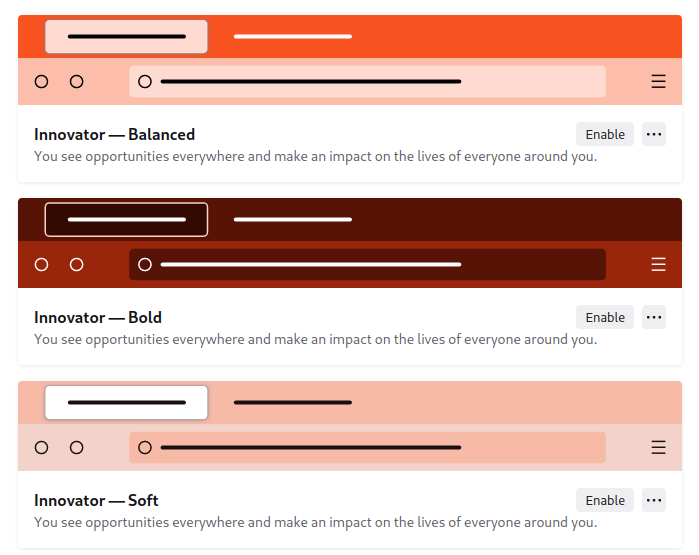

# firefox colorways themes

## Info

Colorways presents 6 colors and 3 modes:
  + Colours:
    - playmaker
    - dreamer
    - activist
    - innovator
    - expressionist
    - visionary
  + Modes:
    - soft
    - balanced
    - bold

## Activation

To activate a theme(s), go to `about:config` and edit the following keys:

```python
browser.theme.colorway-closet: true
# this is the list of themes to activate, either one or many
browser.theme.retainedExpiredThemes: ["dreamer-balanced-colorway@mozilla.org"]
# the previous key can be set to enclose all themes combinations
browser.theme.retainedExpiredThemes: ["playmaker-soft-colorway@mozilla.org", "playmaker-balanced-colorway@mozilla.org", "playmaker-bold-colorway@mozilla.org", "dreamer-soft-colorway@mozilla.org", "dreamer-balanced-colorway@mozilla.org", "dreamer-bold-colorway@mozilla.org", "activist-soft-colorway@mozilla.org", "activist-balanced-colorway@mozilla.org", "activist-bold-colorway@mozilla.org", "innovator-soft-colorway@mozilla.org", "innovator-balanced-colorway@mozilla.org", "innovator-bold-colorway@mozilla.org", "expressionist-soft-colorway@mozilla.org", "expressionist-balanced-colorway@mozilla.org", "expressionist-bold-colorway@mozilla.org", "visionary-soft-colorway@mozilla.org", "visionary-balanced-colorway@mozilla.org", "visionary-bold-colorway@mozilla.org"]
```

Restart firefox and the desired theme can be selected from **Add-ons and themes** > **themes** or can be set before restarting firefox via the key `extensions.activeThemeID` where the value is one the items in the `browser.theme.retainedExpiredThemes` list.

```python
extensions.activeThemeID: activist-balanced-colorway@mozilla.org
```

## Screenshots

### Activist


### Dreamer


### Expressionist


### Innovator



### Playmaker


### Visionary


## Contributions

The following themes are contributed by [@awarmwildfire](https://github.com/awarmwildfire)
  + Colours:
    - abstract: `"abstract-<MODE>-colorway@mozilla.org"`
    - cheers: `"cheers-<MODE>-colorway@mozilla.org"`
    - elemental: `"elemental-<MODE>-colorway@mozilla.org"`
    - foto: `"foto-<MODE>-colorway@mozilla.org"`
    - graffiti: `"graffiti-<MODE>-colorway@mozilla.org"`
    - lush: `"lush-<MODE>-colorway@mozilla.org"`
  + Modes:
    - soft
    - balanced
    - bold

Replace `<MODE>` with a value from the above modes list.

### Abstract


### Cheers


### Elemental


### Foto


### Graffiti


### Lush


